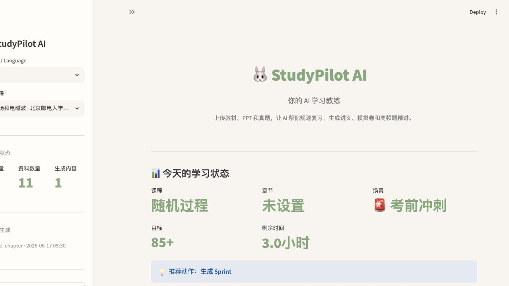
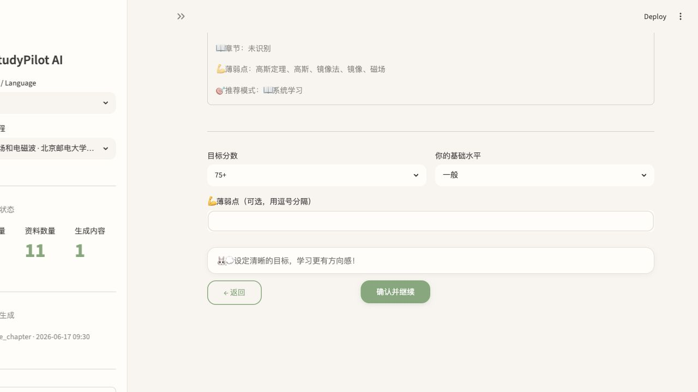
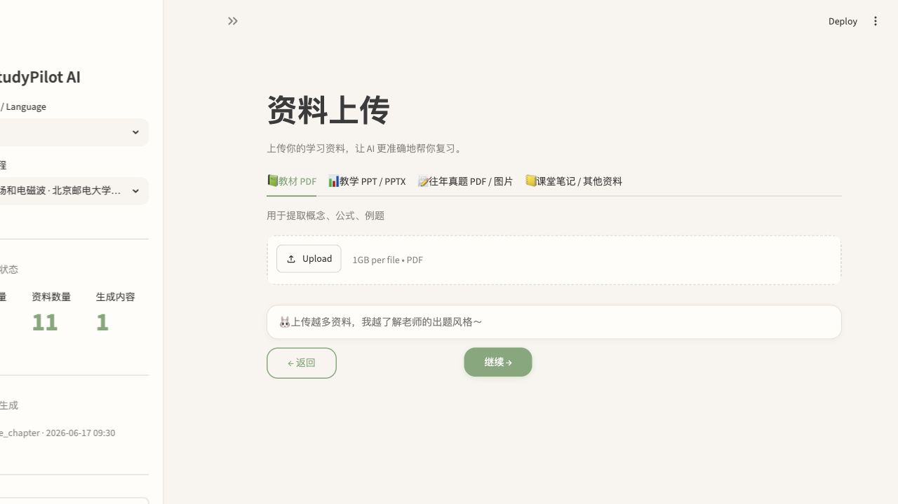
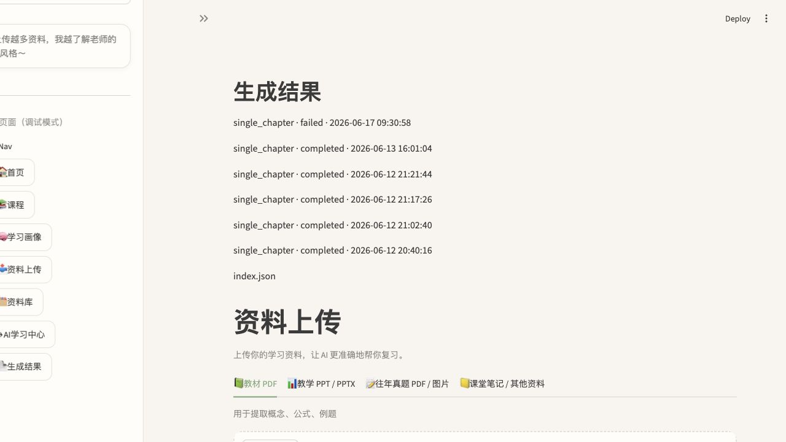

# StudyPilot AI

面向大学生的 AI 学习教练系统。上传教材、PPT 和往年题后，AI 自动构建知识图谱、解析考点规律，并通过 Typst 引擎生成四类正式教学 PDF。

**AI-powered personalized learning coach with OCR, RAG, Knowledge Graph, Exam Pattern Engine and Typst PDF generation.**

当前版本：**StudyPilot AI v1.3 Beta**

## 功能亮点

- 🎯 **个性化学习画像** — 自然语言目标解析 → UserProfile → 自适应推荐场景和 PDF 类型
- 📊 **学习路径图** — 概念依赖可视化，薄弱点高亮，推荐对应 PDF
- 📚 **四类教学 PDF** — Sprint（考前冲刺）/ PastPaper（真题精讲）/ MockExam（模拟试卷）/ Review（章节复习）
- 🔍 **课程级 RAG** — PyMuPDF + FAISS 向量检索，带来源引用的内容生成
- 🧠 **知识图谱 v5** — concept → formula → example → exam-pattern → figure 五维关联
- 🖼️ **Figure Engine** — 教材/真题图像提取、概念匹配、评分与 fallback
- 📝 **Exam Pattern Engine** — 题型模式库 + 难度分级 + 高频考点匹配
- 🐰 **Bunny AI 助手** — 基于用户画像的个性化学习建议

## 技术栈

Python 3.14 · Streamlit · PyMuPDF · FAISS · sentence-transformers · DeepSeek API · Typst · Jinja2 · Pillow

## Demo Artifacts

轻量展示文件位于 `sample_outputs/`：

- `StudyPilot_v5_Review_Demo.pdf`
- `StudyPilot_v5_Review_RealDemo.md`
- `demo_manifest.json`
- `final_demo_report.md`

原始教材、上传资料、模型权重、OCR 缓存、向量库和大体积生成结果不随仓库发布。

## Screenshots / Demo Preview

| 首页 | 目标解析 |
|------|----------|
|  |  |

| 上传资料 | 生成结果 |
|----------|----------|
|  |  |

## v1.3 最新更新

- **UserProfile** — 持久化学习画像，驱动个性化推荐
- **PersonalizationEngine** — 场景识别 + PDF 推荐 + 时间分配 + 学习路径
- **首页 Hero 升级** — 今日学习状态卡 + AI 理解结果展示
- **结果页升级** — 学习建议 + 覆盖率 + 使用场景标签
- **Bunny 增强** — 根据画像输出个性化建议
- **Demo Manifest** — 项目展示素材自动生成

## 系统架构

```
Streamlit UI (v1.3)
  ├── UserProfile (个性化学习画像)
  ├── PersonalizationEngine (推荐引擎)
  │
  ├── Wizard Flow (Home → Goal → Upload → Prefs → Results)
  ├── Task Manager (非阻塞后台生成)
  ├── Output Manager (Run-based 目录管理)
  │
  ├── RAG Engine (PyMuPDF + FAISS + DeepSeek)
  ├── Figure Engine v1.0
  ├── Exam Pattern Engine v4.1
  ├── Knowledge Graph v5
  │
  └── Typst PDF v4.1
```

## 目录结构

```
StudyPilot-AI/
├── app.py                     # Streamlit 主应用 (v1.3)
├── requirements.txt
├── README.md
├── .env.example
├── core/
│   ├── user_profile.py        # 🆕 个性化学习画像
│   ├── personalization_engine.py  # 🆕 推荐引擎
│   ├── assistant_state.py     # Bunny AI 助手
│   ├── goal_parser.py         # 自然语言目标解析
│   ├── output_manager.py      # 输出文件管理 + Demo Manifest
│   ├── task_manager.py        # 非阻塞后台任务
│   ├── deepseek_client.py
│   ├── rag_engine.py
│   ├── vector_store.py
│   ├── knowledge_graph.py
│   ├── pdf_v4/                # Typst PDF 引擎
│   │   ├── pdf_v41_renderer.py
│   │   ├── figure_builder.py
│   │   └── typst_engine.py
│   ├── figure_engine/         # Figure Engine v1.0
│   ├── exam_engine/           # Exam Pattern Engine
│   └── ...
├── scripts/                   # DI 测试脚本
├── docs/                      # 项目文档
│   ├── PROJECT_SHOWCASE.md
│   ├── RESUME_BULLETS.md
│   ├── ARCHITECTURE_V5.md
│   ├── ACKNOWLEDGEMENTS.md
│   ├── THIRD_PARTY_NOTICES.md
│   └── FINAL_ACCEPTANCE_CHECKLIST.md
└── data/
    ├── user_profile/          # 学习画像
    ├── uploads/               # 课程资料
    ├── figure_bank/           # 图像资产库
    ├── outputs/               # 生成结果
    └── vector_store/          # FAISS 索引
```

## 安装方式

```bash
python -m venv .venv
source .venv/bin/activate
pip install -r requirements.txt
```

**Typst 引擎**（PDF v4.1 正式输出需要）：

```bash
brew install typst
```

## 环境变量

```bash
cp .env.example .env
# 填写 DEEPSEEK_API_KEY
```

## 运行

```bash
streamlit run app.py
```

## 已完成的模块

| 模块 | 版本 | 状态 |
|------|------|------|
| UserProfile + PersonalizationEngine | v1.3 | ✅ 完成 |
| Streamlit UI + Wizard Flow | v1.3 | ✅ 完成 |
| Output Manager + Demo Manifest | v1.3 | ✅ 完成 |
| Typst PDF 引擎 (Sprint/PastPaper/MockExam/Review) | v4.1 | ✅ 完成 |
| Exam Pattern Engine | v4.1 | ✅ 完成 |
| Figure Engine | v1.0 | ✅ 完成 |
| Knowledge Graph v5 | v5 | ✅ 完成 |
| RAG v5 | v5 | ✅ 完成 |
| Document Intelligence v5 (架构) | v5.1 | ⚠️ Beta |

## Beta / Optional 模块

| 模块 | 状态 | 说明 |
|------|------|------|
| Marker (marker-pdf) | ✅ 已安装 | 模型下载中（1.34GB，网络延迟） |
| DocLayout-YOLO | ⚠️ 包已安装 | 预训练权重下载 API 404 |
| MinerU | ❌ 不可用 | Python 3.14 不兼容（PyO3 ≤ 3.13） |
| PaddleOCR | ❌ 不可用 | 无 macOS arm64 wheel |

模型权重不随仓库分发。用户需要自行安装第三方工具并下载模型。详见 `docs/ACKNOWLEDGEMENTS.md`。

## 第三方开源致谢

StudyPilot v5.1 预留了以下开源文档智能工具的适配器接口：

- **MinerU** (Apache 2.0) — PDF 结构解析
- **Marker** (GPL-3.0) — PDF 解析与 OCR
- **PaddleOCR** (Apache 2.0) — 中文 OCR
- **DocLayout-YOLO** (Apache 2.0) — 版面检测
- **PyMuPDF** (AGPL-3.0) — PDF 文本提取
- **Typst** — PDF 出版引擎

详见 `docs/ACKNOWLEDGEMENTS.md` 和 `docs/THIRD_PARTY_NOTICES.md`。

## 使用流程

1. 首页 Agent 输入框：告诉 AI 你的目标（例如”明天考电磁场，高斯定理和镜像法不稳”）
2. 查看 AI 理解结果 + 个性化计划 + 学习路径图
3. 设置目标分数和学习偏好
4. 上传教材 PDF 和往年题 PDF
5. 生成 PDF（推荐 Sprint + PastPaper 组合）
6. 下载 PDF / Markdown，查看学习建议

## 后续路线图

- [ ] EasyOCR 作为 macOS arm64 OCR 方案
- [ ] Marker 模型下载完成 → 接入 OCR + 公式提取
- [ ] DocLayout-YOLO 权重修复 → 版面检测 + 图像裁剪
- [ ] Python 3.12 环境测试全 DI 生态
- [ ] 移动端适配
- [ ] 学习数据分析 Dashboard

## License

MIT License. See `LICENSE`.
